## 代码块

```js
const a = new Date();
```

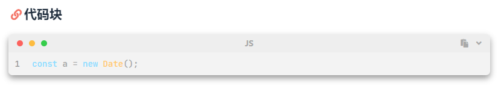

## 壁纸

<div class="gallery-group-main">
    
</div>


## note1

<div class="snote red"><p>默认red</p></div>
<div class="snote quote"><p>quote</p></div>
<div class="snote info"><p>info</p></div>
<div class="snote done"><p>done</p></div>
<div class="snote success"><p>success</p></div>
<div class="snote danger"><p>danger</p></div>
<div class="snote error"><p>error</p></div>
<div class="snote radiation"><p>radiation</p></div>
<div class="snote bug"><p>bug</p></div>
<div class="snote idea yellow"><p>idea-yellow</p></div>
<div class="snote link blue"><p>link- blue</p></div>
<div class="snote paperclip"><p>paperclip</p></div>
<div class="snote todo"><p>todo</p></div>
<div class="snote msg cyan"><p>msg cyan</p></div>
<div class="snote guide"><p>guide</p></div>
<div class="snote download"><p>download</p></div>
<div class="snote up"><p>up</p></div>
<div class="snote undo"><p>undo</p></div>

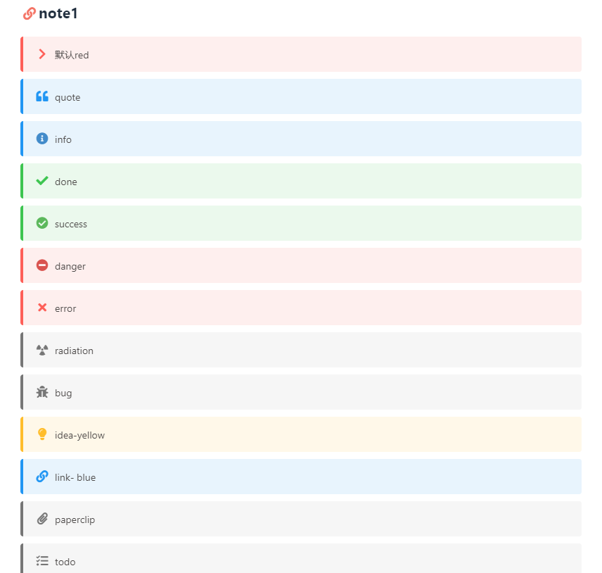

## note2


default



primary



success



info



warning



danger



#### Primary Header**Welcome** to [Hexo!](https://hexo.io)


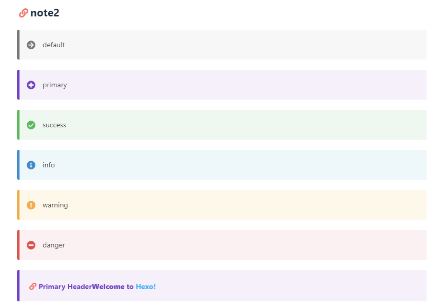

## note3

<div class='tip' ><p>默认情况<p></div>
<div class='tip success'><p>success<p></div>
<div class='tip error'><p>error<p></div>
<div class='tip warning'><p>warning<p></div>

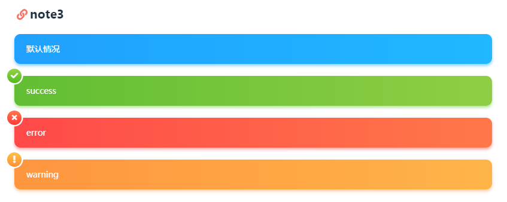

## note4

<p class='div-border green'>绿色</p>
<p class='div-border red'>红色</p>
<p class='div-border yellow'>黄色</p>
<p class='div-border grey'>灰色</p>
<p class='div-border blue'>蓝色</p>

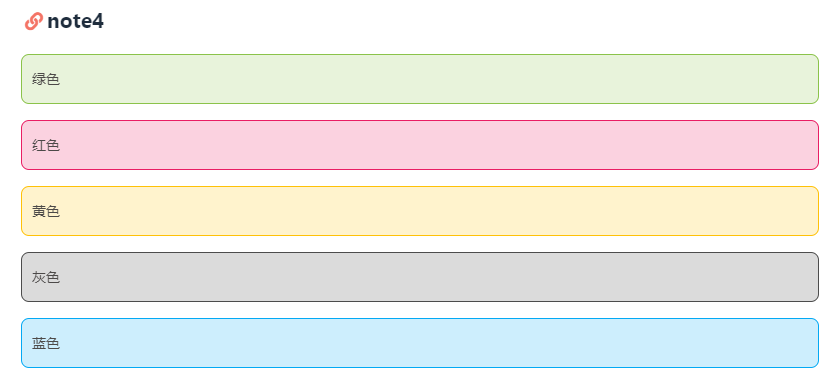

## tag

<span class="inline-tag red">红色小标签</span>
<span class="inline-tag green">绿色小标签</span>
<span class="inline-tag blue">蓝色小标签</span>
<span class="inline-tag yellow">黄色小标签</span>
<span class="inline-tag grey">灰色小标签</span>


## 引用

<div class="snote quote">
  <p class='p subtitle'>小标题</p>
  这是个引用
</div>

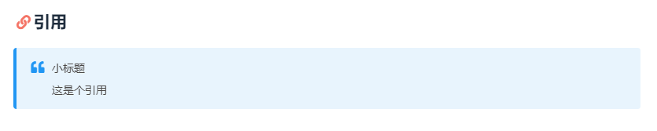

## 折叠内容


 来了老弟


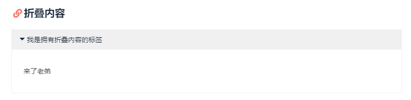

## 图形


pie
    title Key elements in Product X
    "Calcium" : 42.96
    "Potassium" : 50.05
    "Magnesium" : 10.01
    "Iron" :  5


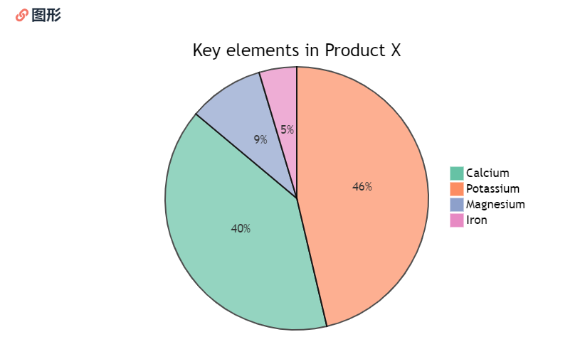

## tab

- 预设选择 3


<!-- tab -->
**This is Tab 1.**
<!-- endtab -->

<!-- tab -->
**This is Tab 2.**
<!-- endtab -->

<!-- tab -->
**This is Tab 3.**
<!-- endtab -->


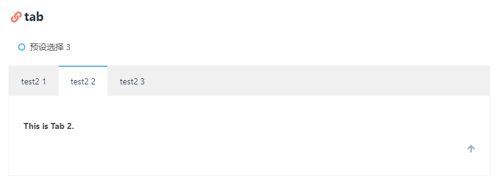

## tab + icon


<!-- tab 第一个Tab -->
**tab名字为第一个Tab**
<!-- endtab -->

<!-- tab @fab fa-apple-pay -->
**只有图标 没有Tab名字**
<!-- endtab -->

<!-- tab 炸弹@fas fa-bomb -->
**名字+icon**
<!-- endtab -->


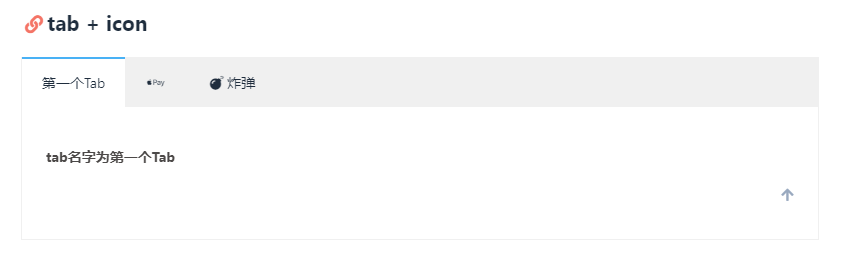

## 按钮

```


[url]         : 链接
[text]        : 按钮文字
[icon]        : [可选] 图标
[color]       : [可选] 按钮背景顔色(默认style时）
                      按钮字体和边框顔色(outline时)
                      default/blue/pink/red/purple/orange/green
[style]       : [可选] 按钮样式 默认实心
                      outline/留空
[layout]      : [可选] 按钮佈局 默认为line
                      block/留空
[position]    : [可选] 按钮位置 前提是设置了layout为block 默认为左边
                      center/right/留空
[size]        : [可选] 按钮大小
                      larger/留空
```

This is my website, click the button 
This is my website, click the button 
This is my website, click the button 
This is my website, click the button 
This is my website, click the button 





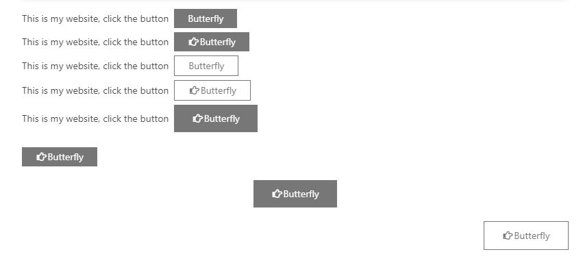

## 多彩按钮









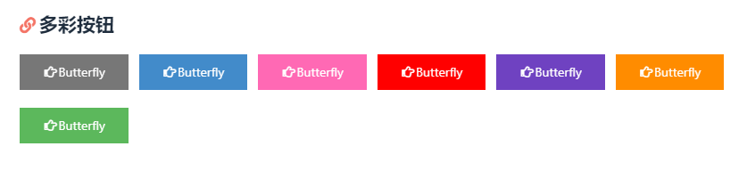

## 多彩边框按钮

<div class="btn-center">







</div>

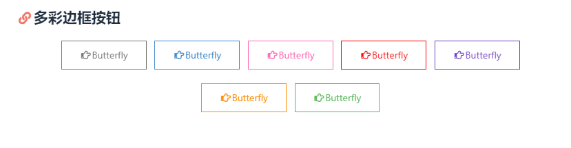

## 时间线

<div id="archive">
  <div class="article-sort-title">我是标题</div>
  <div class="article-sort">
    <div class="article-sort-item year">2020</div>
  </div>
</div>